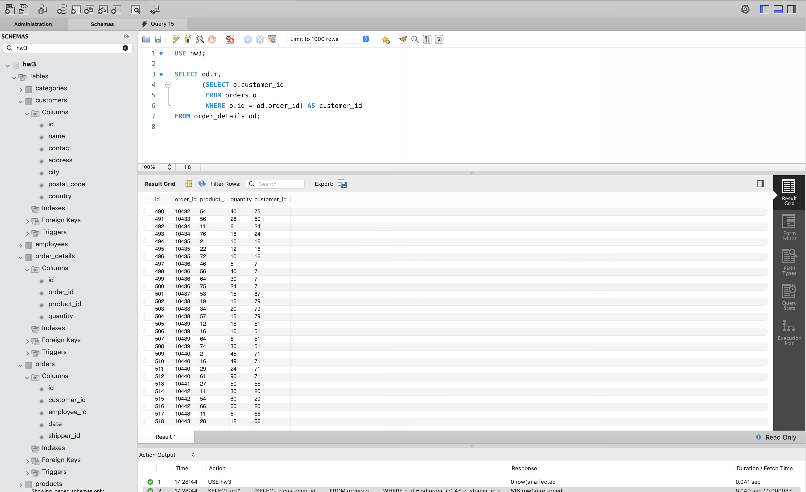
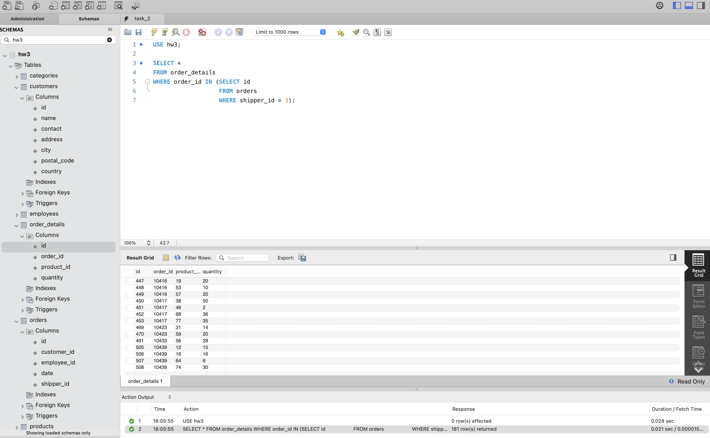
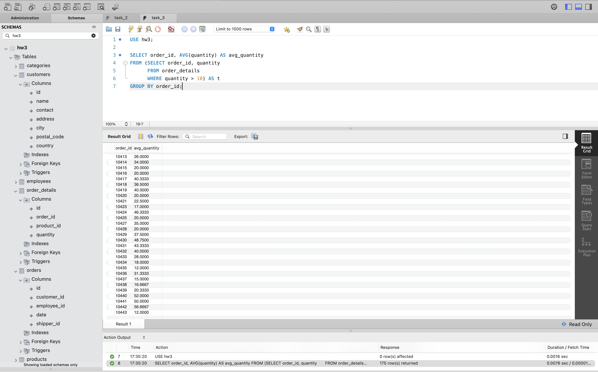
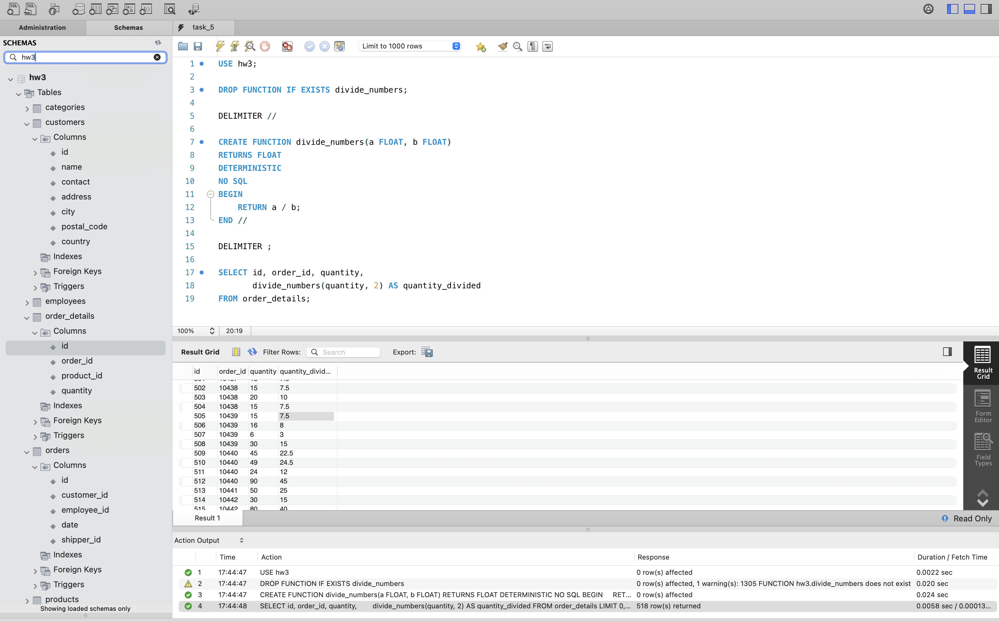

# goit-rdb-hw-05

## ДЗ з РБД: Вкладені запити. Повторне використання коду. Функція

## №1. [Вкладений `SELECT`](sql/task_1.sql)

## №2. [Вкладений `WHERE`](sql/task_2.sql)

## №3. [Вкладений `FROM`](sql/task_3.sql)

## №4. [Тимчасова таблиця через `WITH`](sql/task_4.sql)

## №5. [Функція ділення `divide_numbers`](sql/task_5.sql)

