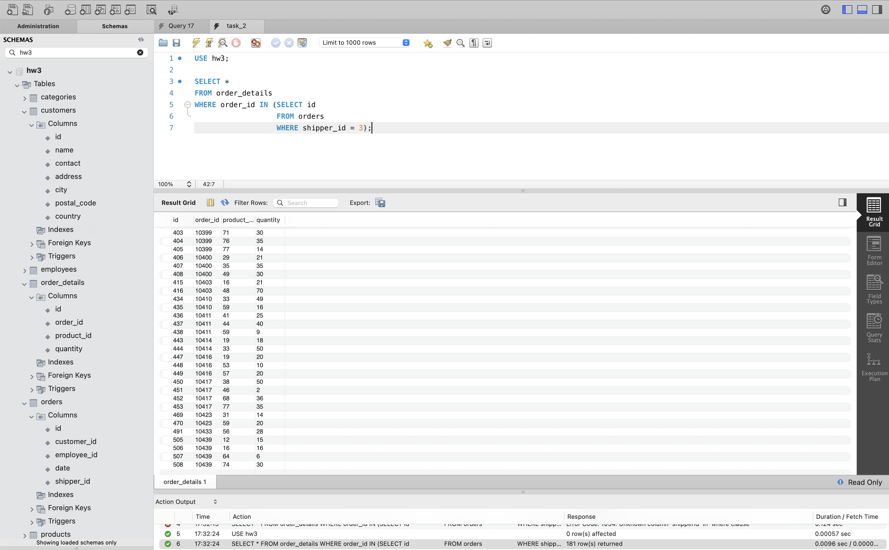
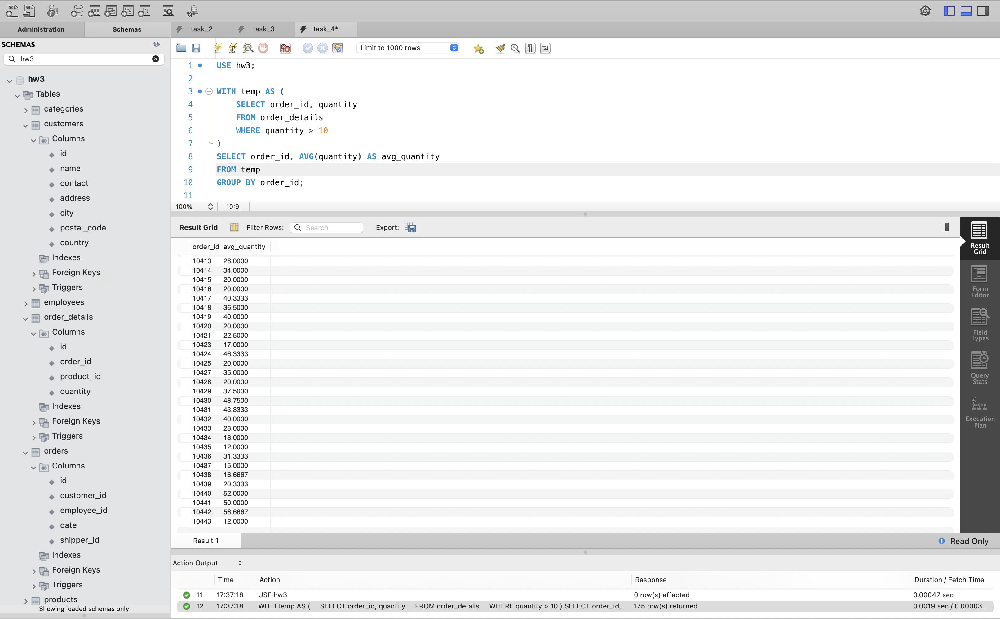

# goit-rdb-hw-05

ДЗ з РБД: Вкладені запити. Повторне використання коду. Функція

## 1. Вкладений `SELECT` — [task_1.sql](sql/task_1.sql)

## 2. Вкладений `WHERE` — [task_2.sql](sql/task_2.sql)

## 3. Вкладений `FROM` — [task_3.sql](sql/task_3.sql)

## 4. Тимчасова таблиця через `WITH` — [task_4.sql](sql/task_4.sql)

## 5. Функція ділення `divide_numbers` — [task_5.sql](sql/task_5.sql)

